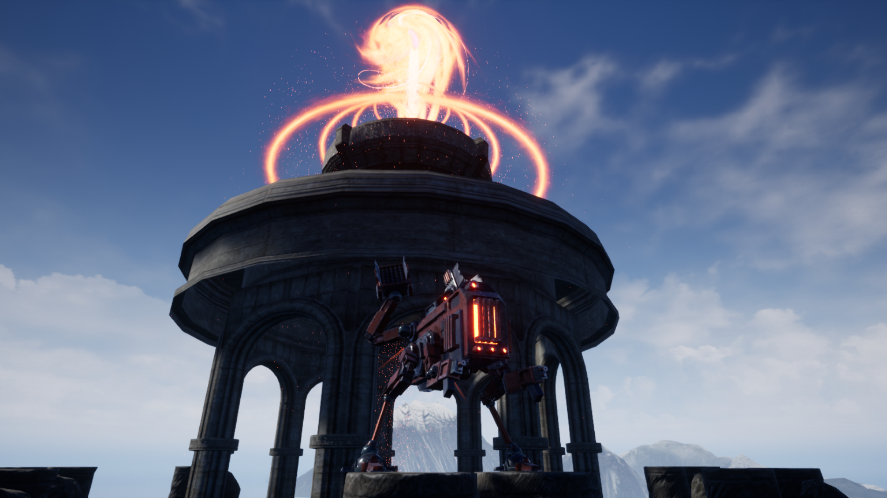

# World of English :dragon:

World of English is an educational game that was made to help students study English. The game was developed with Unreal Engine 4 by Aleksandr Molchagin as a [Final High School project](https://github.com/AleksandrMolchagin/world-of-english/blob/main/final_project) at Borisoglebskaya Gymnasium №1. 

:grey_exclamation: The game is available **only for Windows**.

[

](https://youtu.be/RRO0EtIS4dA "World of English, trailer")

## How to play:

1) Download the game from [here](https://aleksandr-molchagin.itch.io/world-of-english), and extract the archive in one folder.

2) Launch the game using <code>World of English.exe</code> file.

#### Controls:

- WASD - movement;
- Mouse input - camera;
- W + shift (hold) - running;
- Space - jump, climb;
- W (hold) + Shift (hold) + Space - long jump (for platforms);
- W (hold) +  Left Alt -  the same long jump (for platforms);
- Escape - pause.

## How to use project files:

1) Install Unreal Engine 4. 

2) Download the [**<code>src.rar</code>**](https://drive.google.com/file/d/1b4k4vAvDAxS3wAizme2zbAq3Q0NUeZrV/view?usp=sharing) archive.

3) Extract everything using the next password: **<code>beskar</code>**.
4) Double-click **<code>World_Of_English.uproject</code>** file to start the project.

You may explore and modify the project, but do not publish your version of the game or any modifications without the permission of the author.

## Technologies:
- Unreal Engine 4
- Blueprints Visual Scripting system
- Adobe Fuse CC
- Blender
- Audacity

## Authors:
- Aleksandr Molchagin

## License
Some game assets are under either CC Attribution license or CC0.1.0 Universal license. The detailed information is included in the game.

       
